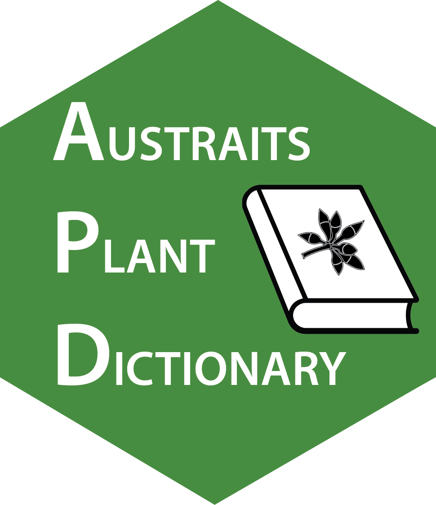

# The AusTraits Plant Dictionary (APD)

<!-- badges: start -->
[](https://doi.org/10.5281/zenodo.8040789)
<!-- badges: end -->



The AusTraits Plant Dictionary (APD) includes the trait definitions used by AusTraits, a database of Australian plant traits. The APD includes definitions for nearly 500 traits pertaining to plant functional ecology and plant morphology. Each trait definition has been reviewed by multiple people and includes references and links to identical/similar traits in other trait databases whenever possible. The APD includes machine-readable formats and endpoints, allowing the traits to be readily re-used by other databases.

**Using the APD?** See the [Using the APD](https://traitecoevo.github.io/APD/using_the_APD.html) guide for how to access the trait definitions and machine-readable endpoints.

The APD is described in the following citation:

> Wenk EH, Sauquet H, Gallagher RV, Brownlee R, Boettiger C, Coleman D, Yang S, Auld T, Barrett RL, Brodribb T, Choat B, Dun L, Ellsworth D, Gosper C, Guja L, Jordan GJ, Breton T, Leigh A, Irving P, Medlyn B, Nolan R, Ooi M, Sommerville KD, Vesk P, White M, Wright IJ, Falster DS (2024) The AusTraits Plant Dictionary. *Scientific Data* 11:537. <https://doi.org/10.1038/s41597-024-03368-z>

## This repository

This repository is the original source for the APD. It includes

- data files 
- code for building machine-readable representations of the APD
- code for generating human-readable access points to the APD
- website files for the APD website

## Data files and format

11 files are stored in `data/` and are used to generate the APD. These files are:

* `APD_traits_input.yml`: The core table of trait definitions, and the source of
  truth for them. `APD_traits_input.csv` is a spreadsheet-friendly view of the
  same 559 traits, produced by `make export-csv` and read back by
  `make import-csv`.
* `APD_trait_hierarchy.csv`: Table documenting a trait hierarchy into which traits in the APD are mapped.
* `APD_categorical_values_input.csv`: Table of allowable categorical trait values for categorical traits within the APD.
* `APD_glossary.csv`: Table of technical vocabulary used for APD trait definitions and keywords which were not located in previously published vocabularies and ontologies.
* `APD_references.csv`: Table of references used in the APD, including dois and complete reference details.
* `APD_reviewers.csv`: Table of people who have reviewed trait definitions for the APD, identified by their ORCIDs.
* `APD_units.csv`: Table of units used in the APD, including links in the Units of Measurement ontology.
* `APD_annotation_properties.csv`: Table of annotation properties that come from a published ontology and are used in the APD. 
* `APD_namespace_declaration.csv`: Table of all ontologies used within APD. These may be ontologies with annotation properties used by the APD (and listed in annotation_properties.csv) or with terms (classes) used by the APD (and listed in ontology_links.csv) .
* `APD_resource.csv`: Information about the two APD resources, APD/traits and APD/glossary
* `published_classes.csv`: List of published terms referenced as keywords (or similar) within the APD.

Each trait includes the following fields:

* trait name (label)
* trait ID
* expected units (for numeric traits; all units aligned to UCUM standards)
* allowable range (for numeric traits)
* allowable trait values (for categorical traits; all trait values are themselves defined)
* trait definition (A definition with technical terms linked to published ontologies as well as, when applicable, longer definitions and comments
* keywords
* structure measured (what plant part is measured, referencing a specific tissue, organ, or the whole plant)
* characteristic measured, such as whether the trait records `mass`, `shape`, `length`, etc.
* a trait hierarchy
* references
* names/ORCIDs of people who have reviewed the trait definition
* links to identical/similar/related traits in other plant trait databases
* dates the trait was first added, most recently modified, and reviewed

## Instructions for building the APD

Everything runs through `make`. Run `make` on its own for the list of targets.

```bash
make data        # build the dictionary from data/
make check       # validate the built dictionary
make site        # render the website into docs/
make release     # check the version, then snapshot into release/<version>/
```

Each target runs a script in `scripts/`, which calls functions in `R/`. To edit
trait definitions in a spreadsheet rather than in the YAML:

```bash
make export-csv  # data/APD_traits_input.yml -> data/APD_traits_input.csv
                 # edit the CSV in Excel or similar
make import-csv  # write the edits back to the YAML and print what changed
make check
```

`make data` builds from the data files in `data/`, producing:

- machine-readable representations of the APD, including
  - RDF Turtle: `APD.ttl`,
  - N-Quad: `APD.nq`, 
  - N-Triple: `APD.nt`, 
  - JSON Linked Data format: `APD.json`
- the two flat tables downstream packages read: `APD_traits.csv` and
  `APD_categorical_values.csv`

`make site` creates the APD website, saved in `docs/`
  - hosting via Github pages at <https://traitecoevo.github.io/APD/>
  - created from files `index.qmd` and configured with `_quarto.yml`
  - uses the `quarto` package for R, with instructions on formatting from <https://quarto.org/docs/reference/projects/websites.html
  - we were inspired by <https://i-adopt.github.io> with code from <https://github.com/i-adopt/i-adopt.github.io>

The APD is accessible via <https://w3id.org/APD/>, <https://w3id.org/APD/traits/>, and <https://w3id.org/APD/glossary/>. These links redirect to the site generated here. To enable the links, we sent a pull request to the [w3id.org repo](https://github.com/perma-id/w3id.org/), like this example from <https://github.com/perma-id/w3id.org/blob/master/iadopt/>.

Redirect syntax can be tested at <https://htaccess.madewithlove.com>.

## Testing w3id.org access

To test the redirects via <w3id.org/APD> try the following

```
curl -sH "Accept: text/turtle" -L https://w3id.org/APD > temp.ttl
curl -sH "Accept: text/turtle" -L https://w3id.org/APD/traits > temp2.ttl
curl -sH "Accept: text/turtle" -L https://w3id.org/APD/traits\#trait_0001 > temp3.ttl

curl -sH "Accept: application/n-triples" -L https://w3id.org/APD > temp.nt
curl -sH "Accept: application/n-triples" -L https://w3id.org/APD/traits > temp2.nt
curl -sH "Accept: application/n-triples" -L https://w3id.org/APD/traits\#trait_0001 > temp3.nt

curl -sH "Accept: text/html" -L https://w3id.org/APD > temp.html
curl -sH "Accept: text/html" -L https://w3id.org/APD/traits > temp2.html
curl -sH "Accept: text/html" -L https://w3id.org/APD/traits\#trait_0001 > temp3.html
```

## AusTraits family

`APD` is part of the **AusTraits family** of packages maintained by the
[AusTraits](https://austraits.org) team. See **[austraits.org](https://austraits.org)** for the
project, the data, and the people behind it.

Contributing? Issues across the family are tracked on one board,
[AusTraits #9](https://github.com/orgs/traitecoevo/projects/9), and new issues are auto-added. Please
read the [issue & labelling guide](https://github.com/traitecoevo/austraits-meta/blob/main/governance/issue-guide.md)
in [`austraits-meta`](https://github.com/traitecoevo/austraits-meta) — the family's cross-package
knowledge and governance hub — before filing.

## Acknowledgements

We are grateful to S Cox, J Smillie, K Levett, M Barlow, and C Brady for useful conversations.

AusTraits is made possible by contributions from our partner organisations — the
[University of New South Wales](https://www.unsw.edu.au/),
[Western Sydney University](https://www.westernsydney.edu.au/),
[Botanic Gardens of Sydney](https://www.botanicgardens.org.au/),
[the University of Melbourne](https://www.unimelb.edu.au/),
the [Atlas of Living Australia](https://www.ala.org.au/), and the Australian Government
[Department of Climate Change, Energy, the Environment and Water](https://www.dcceew.gov.au) — and
from our [advisory board, data contributors, and past partners](https://austraits.org/team/team-partners.html).

AusTraits is a co-investment partnership with the
[Australian Research Data Commons](https://ardc.edu.au/) (ARDC) through the Planet Research Data
Commons ([DOI: 10.3565/nyk4-4r91](https://doi.org/10.3565/nyk4-4r91)). The ARDC is enabled by the
Australian Government's [National Collaborative Research Infrastructure Strategy](https://www.education.gov.au/ncris)
(NCRIS).

This work received investment ([DP720](https://doi.org/10.47486/DP720)) from the ARDC. 

